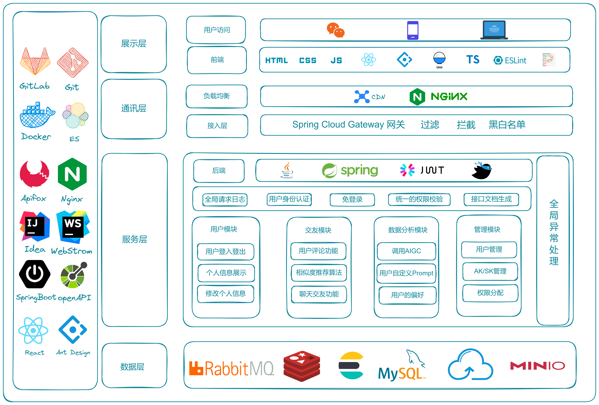
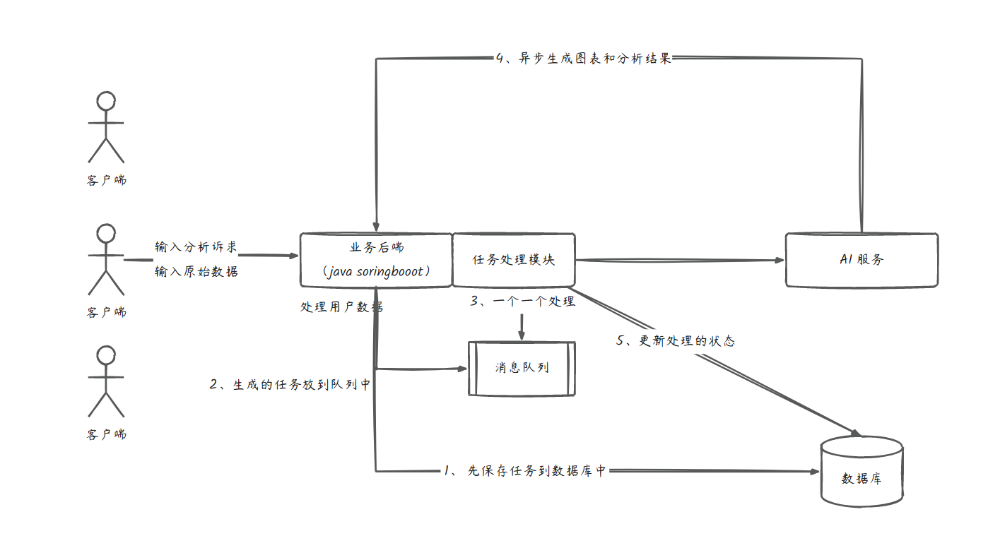
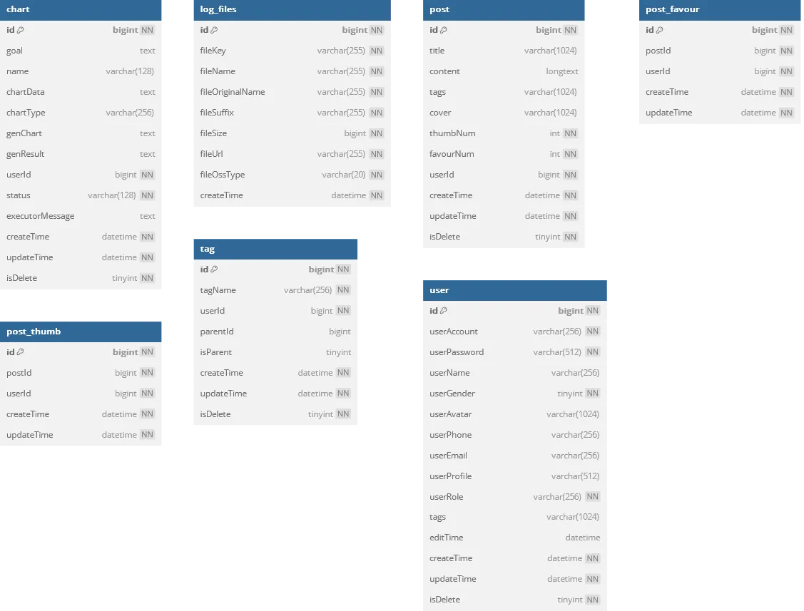
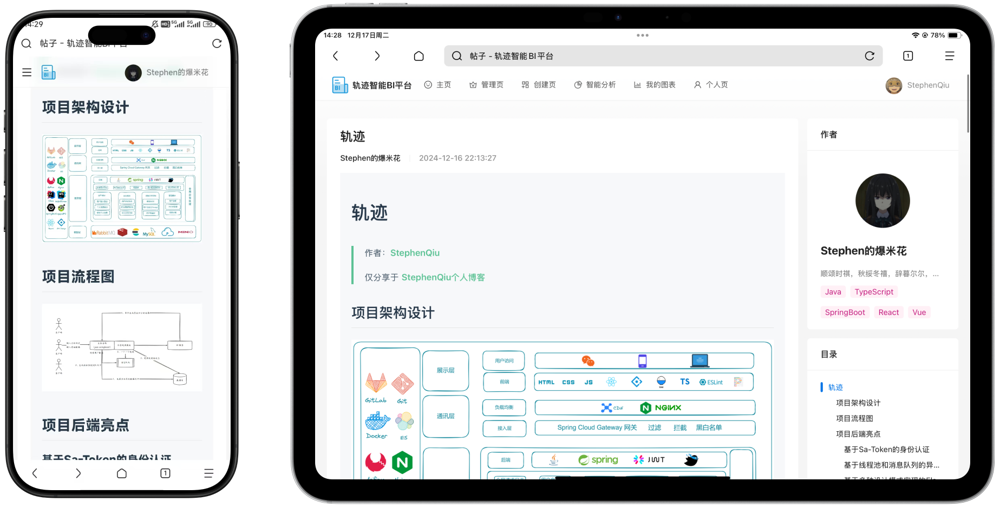
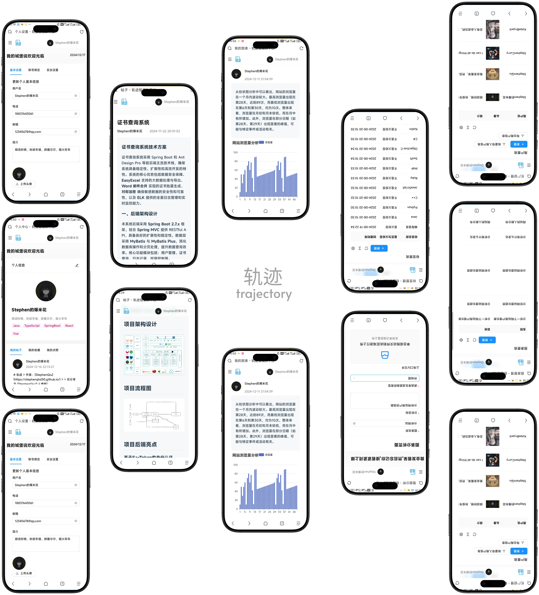
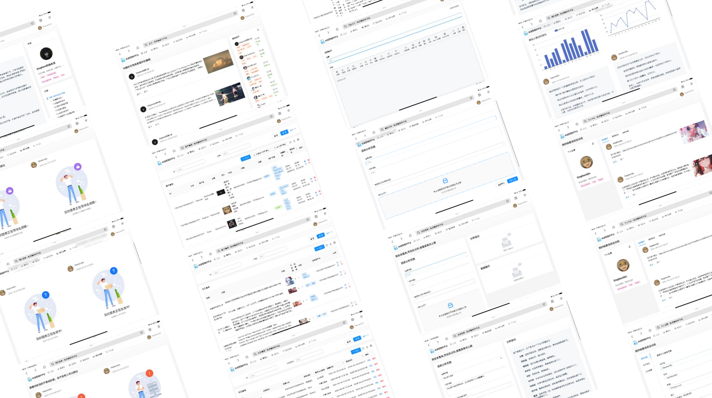
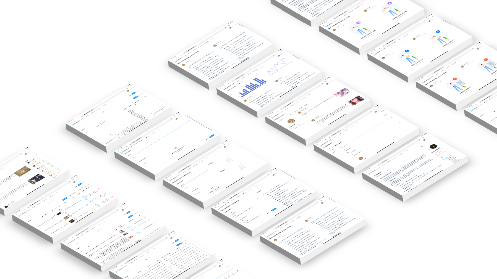

# 轨迹

> 作者：[StephenQiu](https://stephenqhd30.github.io/)
>
> 仅分享于 [StephenQiu个人博客](https://stephenqhd30.github.io/)

BI 商业智能：数据可视化，报表可视化系统
主流的 BI 平台：帆软 BI、小马 BI、微软 Power BI
需求分析
1. 智能分析：用户输入目标和原始数据（图表类型），可以自动生成图表
2. 图表管理
3. 图表生成的异步化（消息队列）
4. 对接 AI 能力

## 技术选型：
### 前端：
1. React
2. Ant Design Pro + Umi.js
3. 数据可视化开发库（AntV / ECharts）
4. umi openapi 代码生成（自动生成前后端请求代码）

### 后端：
1. SpringBoot （Java后端项目模板）
2. MySQL
3. Mybatis-Plus + Mybatis 数据访问框架
4. 消息队列（RabbitMQ）
5. AI 能力 （Open AI 接口开发 / 现成的 AI 调用能力）
6. Excel 的上传和数据的解析（Easy Excel）
7. Swagger + Knife4j 项目接口文档
8. HuTool 工具库

## 项目架构设计

## 项目流程图

## 数据库表设计

## 项目后端亮点

### 基于Sa-Token的身份认证

**(Identity Authentication with Sa-Token)**

Sa-Token作为一种轻量级、灵活的权限框架，实现了高效的身份认证与权限管理。该认证机制具有灵活的扩展性、易于集成的特点，可以支持单点登录（SSO）、分布式认证等功能，为系统提供了强大的安全保障，同时优化了用户体验和管理效率。

### 基于线程池和消息队列的异步化流程

通过线程池和消息队列实现异步化流程，极大提高了系统的响应速度和并发处理能力。线程池高效管理资源，避免频繁创建销毁线程的性能损耗；消息队列则确保了任务的可靠传递和顺序处理，使系统具备更高的伸缩性和稳定性，尤其在高并发场景下表现尤为出色。

### 基于多种设计模式实现的Elasticsearch聚合搜索

通过结合多种设计模式，如注册器模式、适配器模式和门面模式，优化了Elasticsearch的聚合搜索功能。这种方法使得搜索结果的聚合更加灵活、高效，并能根据需求动态调整聚合规则和计算方式，提升了数据处理和查询的精准度与效率。

### 基于AIGC实现的数据可视化分析流程

基于AIGC技术实现的数据可视化分析流程，借助AI生成的图表和报告，帮助用户自动化分析和展示复杂数据。通过智能算法和数据挖掘技术，系统能够快速生成高质量的可视化分析结果，不仅提升了数据处理效率，还使得决策者能够快速理解数据背后的趋势和关系。

## 项目前端亮点

### React + TypeScript + Ant Design Pro

结合React、TypeScript和Ant Design Pro，构建了高效且易于维护的前端应用。React提供了组件化开发的优势，TypeScript增强了代码的类型安全，Ant Design Pro则提供了一套完整的UI组件库，使得开发过程更加高效、可靠，同时保证了应用的高可用性和用户友好界面。

### Umi Request + Open API 实现接口文档的自动生成类型

利用Umi Request与Open API规范，实现了接口文档的自动生成类型。这种集成方式通过动态提取API接口信息，自动生成类型定义，减少了手动编写文档的工作量，提高了开发效率。自动化的文档生成和类型推断确保了接口的一致性和准确性，减少了潜在的错误和维护成本。

### 基于Markdown语法实现文档的编辑和渲染及导出

通过基于Markdown语法的编辑器，用户可以方便地创建、编辑和渲染文档，支持文档内容的即时预览。文档编辑过程轻松直观，同时支持多种格式的导出（如PDF、HTML等），使得文档管理与分享变得更加高效，适合团队协作与文档版本控制。

### 基于响应式设计实现多设备适配

通过响应式设计技术，应用能够根据不同设备的屏幕大小和分辨率自动调整布局和元素，确保在桌面、平板和手机等不同终端上都能提供良好的用户体验。使用CSS媒体查询、流式布局和弹性设计，系统能够灵活适应不同的屏幕尺寸和设备方向，提升了应用的跨平台兼容性和用户体验，无论用户使用何种设备访问，都能获得一致且优化的界面。

## 优化点

### 基于WebSocket实现实时数据更新与交互

通过WebSocket技术实现了实时数据的推送与交互。这使得前端能够实时接收后端数据的变化，并即时更新UI，提升了用户体验。特别适合需要展示实时信息的应用场景，如在线监控、实时消息和数据分析。WebSocket的低延迟特性确保了高效的双向通信，增强了系统的响应速度和实时性。

### 基于服务端渲染（SSR）提升SEO与页面加载速度

通过服务端渲染（SSR）技术，将React应用的初始页面渲染放在服务器端完成，提高了页面的加载速度，并对搜索引擎优化（SEO）提供了支持。这种方式可以显著提升首屏加载时间，尤其对SEO有较大优势，提升了站点的可见性和用户体验。

### 基于 Spring Cloud Gateway 实现统一网关

通过 Spring Cloud Gateway 实现系统的统一网关管理，作为所有请求的入口。网关提供了动态路由功能，支持灵活的请求分发，同时内置限流、熔断和降级机制，有效保护后端服务免受流量冲击。结合身份认证与权限校验，网关还能够统一管理服务的安全策略，提升了系统的整体安全性和可维护性。

### 基于 Spring + ShardingSphere 实现 MySQL 分库分表

通过 ShardingSphere 框架结合 Spring Boot 实现分库分表，将单库的海量数据分散到多个库和表中。分库分表技术显著降低了单表的存储与查询压力，同时支持水平扩展，能够灵活应对业务数据的增长需求。此外，分库分表还提升了查询性能，优化了系统的并发能力，在高并发场景下保证了数据库的稳定性和高效性。

## 项目UI图展示效果

